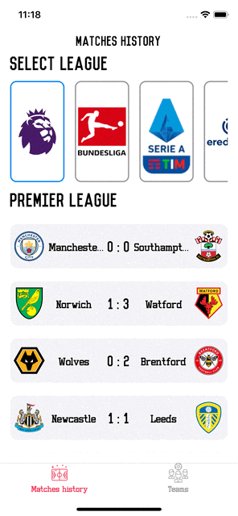
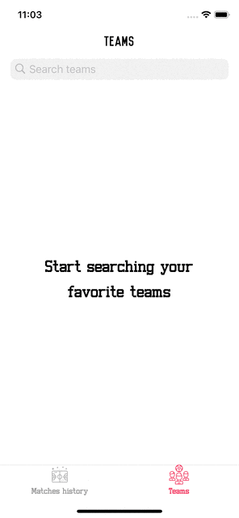
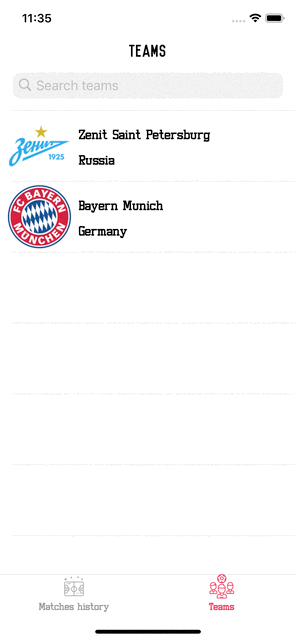
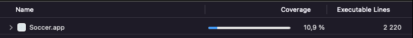

# Bevy Soccer  
## Приложение для просмотра истории футбольных матчей, их статистики и любимых команд

## 🔧 Настройка проекта

* После клонирования или скачивания zip-архива проекта необходимо из корневой директории проекта выполнить следующую команду для установки зависимостей:
    ```zsh
    ./carthage.sh bootstrap --platform iOS
    ```
    **Примечание:** чтобы без проблем установить зависимости проекта и избежать ошибок со сборкой под неиспользуемые архитектуры, стоит запускать именно через этот скрипт вместо локально установленного <code>Carthage</code>
* Проект следует собирать и запускать в релиз-сборке

# Описание проекта
* Приложение имеет 4 экрана + LaunchScreen
* Проект полностью удовлетворяет каждому из требований ТЗ + выполнены два дополнительных пункта: системы аналитики и SwiftLint
* Для проекта созданы две конфигурации: debug и release. Они имеют разные названия и разные иконки для собираемых приложений.

## Итерфейс приложения
* Приложение состоит из двух основных частей: история мачтей и поиск команды по названию
* На первой части отображается история матчей для каждой лиги и при нажатии на ячейку таблицы статистика этого матча  
* На второй части приложения отображается таблица и строка для поиска команды по ее названию  
   
* При свайпе ячейки она удаляется из хранилища (в данном случае CoreData)  


## 🏛 Архитектура приложения

* MVVM + Coordinator
* Для каждого экрана написан свой координатор, удовлетворяющий единому протоколу

## 🤖 Работа с сетью

* Для работы с сетью было взято решение API-FOOTBALL (https://www.api-football.com/), размещенное на RapidAPI (https://rapidapi.com/api-sports/api/api-football/)
* Для избежания повторения одинаковых участков кода, был написан парсер, принимающий в себе Generic-объект

## 🎭 Работа с потоками

* Вся загрузка и парсинг объектов из сети происходит вне основной очереди
* Для загрузки изображений по их URL-адресу было создано два workItem: один на concurrent-очереди, который получает данные из сети и обрабатывает их, другой - на основной, устанавливающий изображение для ячейки. Чтобы изображения не проскакивали при прокрутке ячейки, в методе <code>prepareForReuse()</code> у обоих workItem'а вызывается метод для отмены задачи.

## 💿 Хранение данных

* При поиске футбольной команды по ее названию и переходе на ее детальный экран, объект это команды сохраняется в CoreData  
* Для хранения изображений, полученных из сети, испольуется кэширование
* Индекс выбранного TabBarItem записывается в UserDefaults через оберертку в виде Property Wrapper

## 📝 Стиль кода

* В качестве стиля написания кода было выбрано решение от Google: https://google.github.io/swift/#attributes
* Используется Swiftlint

## ⚙️ Тестирование приложения

* В процессе написания юнит-тестов был создан один Mock, эмулирующий запросы в сеть, на основе которого две ViewModel'и покрыты тестами.
* Общее покрытие кода юнит-тестами составило 10.9%  
  
* Также был написан UI-тест через PageObject, закрывающий полностью модуль с поиском команд.
* Для экрана истории матчей был написан Snapshot-тест

## 💥 Системы аналитики и анализа сбоев приложения

* Firebase Crashlytics
* Firebase Analytics

## 🛠 Менеджер пакетов для установки зависимостей
* В качестве менеджера управления зависимостями используется <code>Carthage</code>
* Поскольку <code>Firebase</code> работает с <code>Carthage</code> в эксперементальном режиме, для установки использовался гайд с официального репозитория <code>Firebase</code> на <code>GitHub</code> (https://github.com/firebase/firebase-ios-sdk/blob/master/Carthage.md)